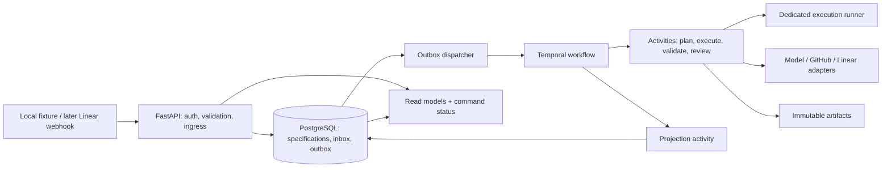

# Architecture

Decision baseline: 2026-09-27. This is the target design. The repository foundation is not a complete delivery platform; consult the README for implemented capabilities.

## Shape and stack

Use a modular monolith: Python 3.12, FastAPI, Pydantic 2, SQLAlchemy 2, Alembic, PostgreSQL and Temporal's Python SDK. One application package has API and worker entry points. The worker invokes small activities through interfaces for the issue tracker, source control, model provider, execution environment and artifact store. Keep third-party client objects out of domain models.

The workflow sandbox provided by an SDK is not the code-execution sandbox. Untrusted repository commands run only on the dedicated execution runner under the [security model](security-model.md).

## Ownership and consistency

| Concern | Authority | Rules |
|---|---|---|
| Submitted ticket and criterion revisions | PostgreSQL | Immutable versioned input snapshots; edits create a revision. |
| Ingress receipt / dispatch intent | PostgreSQL inbox and outbox | Persist together in one transaction; provider delivery IDs and API idempotency keys are unique. |
| Running workflow lifecycle and accepted decisions | Temporal history | All transitions pass through the workflow. The API cannot patch projected state. |
| Workflow list/detail views | PostgreSQL projection | Include workflow ID, run ID, transition sequence and projection timestamp. Label staleness; never authorize from this view. |
| External branch/PR/check state | GitHub | Re-fetch authoritative head and check references before accepting evidence or presenting readiness. |
| Evidence bytes | Artifact store | Content digest, immutable location, retention and access policy. PostgreSQL keeps metadata and relationships. |
| Long-lived audit evidence | PostgreSQL append-only events + retained artifacts | Temporal history has retention limits. Export required evidence before expiration; append-only is not a claim of tamper-proof storage. |

No transaction spans Temporal, PostgreSQL and GitHub. The design handles this explicitly:

1. Ingress commits its input, command receipt and dispatch outbox record atomically; return a command ID.
2. A dispatcher delivers a stable workflow/command ID. Redelivery is expected. Starting the same logical workflow must resolve to the existing run, never silently create a second execution.
3. The workflow validates revision and policy guards, records the decision, and produces sequenced projection events via an idempotent activity.
4. The projection activity inserts the event and updates the view in one database transaction using a unique `(workflow_id, sequence)` key. Old or duplicate events cannot overwrite newer state.
5. A reconciliation job detects undelivered commands, missing projections and ambiguous provider operations. It repairs from recorded authority rather than interpreting a stale view as permission to act.

An outbox row marked delivered means transport succeeded; the command remains pending until the workflow reports applied or rejected. Record rejected requests even if a Temporal Update validator rejects them before adding an accepted event to history. Updates are appropriate for operator commands needing a result; Signals are appropriate for verified external notifications. See the [research review](research/02-architecture-review.md) for platform sources.

## Domain and persistence model

The initial model should stay small. Use UUIDs internally, UTC timestamps, schema versions and structured enums. Treat external IDs and URLs as data, not executable instructions.

| Entity | Required content and invariants |
|---|---|
| `Repository` | Allowlisted provider/repository identity, base branch and execution profile. |
| `WorkItemRevision` | Work item ID, revision, source identity, title, requirements, repository ID, acceptance criteria and content digest. Unique source identity per installation. |
| `WorkflowRun` | Logical workflow ID, Temporal run ID, input revision, policy/config versions, budget, projected lifecycle, transition sequence. |
| `CommandReceipt` / `InboxEvent` / `OutboxMessage` | Stable IDs, payload digest, actor, received time, delivery/application status, retry metadata. Same idempotency key with a different payload is a conflict. |
| `Plan` | Immutable plan version, input revision, base SHA, intended files, verification plan, risk and artifact digest. |
| `Approval` | Actor/role, decision, purpose, spec/plan/policy versions, base/head SHA when applicable, evidence-manifest digest, issue and expiry times. |
| `AgentRun` / `OperationReceipt` | Role, model/config version, attempt, inputs/outputs, logical operation key, provider resource IDs, costs and outcome including `UNKNOWN`. |
| `Artifact` / `VerificationEvidence` | Digest, storage reference, criterion ID, repository snapshot/head, command, exit code, pass/fail/unknown, test provenance and producing run. |
| `ReviewFinding` / `PullRequest` | Reviewer context, finding severity/provenance, exact reviewed head; PR identity, head and separately observed delivery status. |
| `AuditEvent` | Monotonic sequence per workflow, actor, reason, previous/next lifecycle, revision references and correlation ID; secrets excluded. |

Store money as fixed-precision decimal with currency, not binary floats. Preserve actual provider usage separately from estimates. Artifacts contain summaries and tool results, never hidden model reasoning. Large logs/prompts do not belong in workflow history.

SQLAlchemy sessions are scoped to a request or activity transaction. Use database uniqueness, foreign keys and conditional version updates, not check-then-insert application logic. Review Alembic migrations and test clean-database upgrades. PostgreSQL extensions are unnecessary for the foundation.

## Work execution and independence

Requirements/planning, builder and independent reviewer are the initial model roles. A model proposes actions; deterministic code enforces policy and validates evidence schemas. Reviewer context receives the ticket, approved plan, diff and permitted evidence without builder-private conversation. The builder cannot approve its own changes or mint passing verification results.

Pin the repository base commit and retain the resulting head SHA for every attempt. Tests execute against that head in a fresh validation context. Artifacts connect each acceptance criterion to observed evidence. A changed head invalidates the review bundle, even if the branch name is unchanged. The initial graph includes files, Python imports and explicit test relationships, records unknown coverage, and expands rather than narrows validation when confidence is insufficient.

## Idempotency, retries and uncertainty

Use a business operation key such as `work_item_id / execution_generation / step / revision`, stable across activity retries. A deliberate re-run gets a new generation; retries do not. A branch name, sandbox label and PR marker should carry that identity where supported. Provider responses are persisted before an activity is considered complete.

External writes can succeed while their response is lost. On retry, look up the operation's resource and compare expected identity and state. If the provider cannot establish the result safely, record `UNKNOWN`, stop dependent actions and request operator reconciliation. Never claim exactly-once external writes. Model generation retries also consume budget and can differ; persist an accepted artifact and reuse it instead of silently generating a replacement.

Define bounded retry policies per activity class. Retry transport errors, limited rate limits and transient infrastructure failures; do not retry invalid credentials, policy denial, schema errors or failed acceptance checks as transport errors. Test failures enter a bounded correction loop. Enforce per-command timeout, activity timeout, total ticket deadline, token/cost budget and maximum correction attempts. Long-running execution activities heartbeat and react to cancellation. Worker code upgrades require replay tests and workflow versioning.

## Human decisions and external changes

Authenticate and authorize decision-makers outside the model. Approval identifies exactly what is permitted: planning, execution, sensitive access or readiness sign-off. Include expected workflow sequence and input/policy revisions. Code-related approval also binds plan digest, base/head SHA and evidence manifest. Revalidation checks those values against current authoritative state; changed code, requirements, policy or evidence invalidates it.

All merges remain human actions through GitHub in the MVP. The application has no merge or deploy command. GitHub branch protection and required checks must independently enforce repository policy. A later merge notification changes observed delivery status; it is not proof of a deployment or of continuing correctness after new changes.

## API contract to implement in stages

Foundation may implement only the local portions listed in the README. The following is the target contract, not an endpoint availability claim.

| Stage | Endpoint | Behavior |
|---|---|---|
| Local foundation | `GET /healthz` | Process liveness only; do not label it dependency readiness. |
| Durable local slice | `POST /work-items` | Validate local submission and idempotency key; create immutable revision and start command; return 202 plus IDs. |
| Durable local slice | `GET /work-items/{id}` / `GET /workflows/{id}` | Return projections, sequence and freshness metadata. |
| Durable local slice | `GET /commands/{id}` / `GET /workflows/{id}/events` | Distinguish received, applied and rejected commands; paginated audit timeline. |
| Durable local slice | `POST /work-items/{id}/clarifications` | New requirement revision; invalidate dependent plan/evidence. |
| Durable local slice | `POST /work-items/{id}/approve-plan` | Authenticated, revision-bound command; 409 on stale guard. |
| Durable local slice | `POST /work-items/{id}/cancel` | Request cancellation and bounded cleanup; never imply a merge rollback. |
| Connected MVP | `POST /webhooks/linear` / `POST /webhooks/github` | Verify signatures over raw bytes, bound size, deduplicate and enqueue. |
| Connected MVP | `GET /pull-requests/{id}/evidence` | Exact-head manifest with stale/unknown status explicit. |
| Connected MVP | `POST /pull-requests/{id}/human-review` | Record scoped review decision; does not merge. |

Use 422 for invalid data, 401/403 for authentication/authorization failures and 409 for stale/conflicting revisions. A 202 response is only acceptance into the command pipeline. Add dependency readiness only when it probes configured dependencies. No arbitrary shell endpoint exists.

## Recovery and operations

Process restarts resume from durable history. Reconcile container leases and operation receipts before scheduling replacement execution. A lost sandbox is rebuilt from the recorded base/head plus verified artifacts, not from an unverified host directory. Failed cleanup remains visible as an operations incident with resource identity and retry status.

Cancellation stops new work, revokes temporary capability grants, cancels active activities, preserves evidence and attempts bounded resource cleanup. Do not auto-delete published branches or close PRs without a policy explicitly authorizing that action. Recovery from a terminal failure is a new generation linked to the original run; do not edit history or silently reuse previous approval.

The foundation uses local services and fixture data. Shared/multi-tenant deployment, object storage, hosted Temporal, extensive telemetry and production hardening require separate exit criteria. Local Temporal development service configuration is not a production deployment design.
