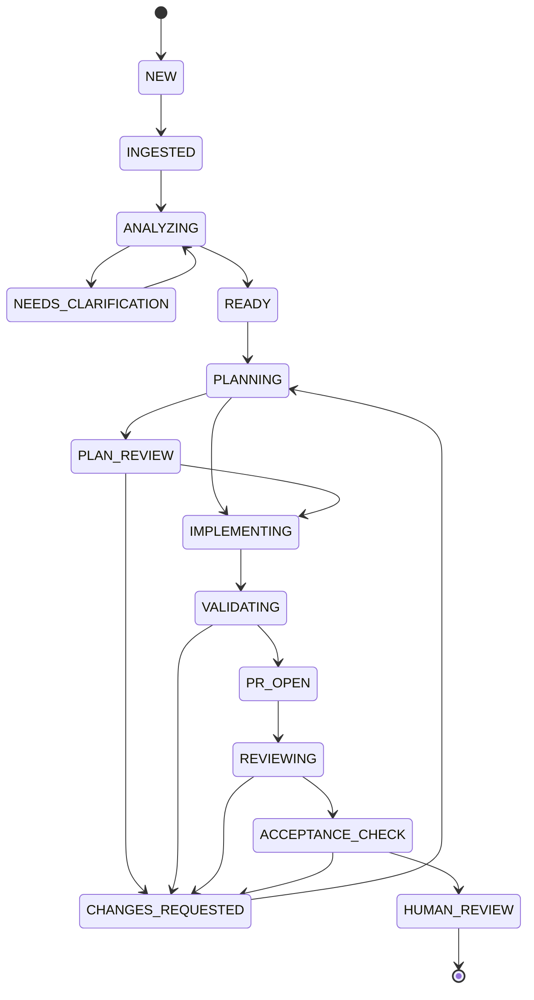

# Delivery lifecycle

Baseline: 2026-09-27. `domain/lifecycle.py` implements a pure transition graph. It does not persist events, authenticate actors, enforce the guards below, or run Temporal. These guards are requirements for the durable workflow implementation.

The successful MVP workflow ends at `HUMAN_REVIEW`: the PR and evidence are ready for a human. This does not mean merged, deployed or production-verified. Human merge is mandatory for all tiers. Later GitHub outcomes are observed separately; there is no agent merge/deploy transition.

Any nonterminal state may enter `FAILED`, `CANCELLED` or `POLICY_BLOCKED`. Those three states and `HUMAN_REVIEW` are terminal for this execution attempt. The diagram omits repeated failure/cancellation edges for readability.

## Transitions and required guards

| From | To | Durable implementation guard / required evidence |
|---|---|---|
| `NEW` | `INGESTED` | Authenticated local submission or verified webhook, deduplicated receipt, allowed repository and immutable input revision. |
| `INGESTED` | `ANALYZING` | Input snapshot recorded; schema version supported. |
| `ANALYZING` | `NEEDS_CLARIFICATION` | Explicit unresolved questions; no execution authorization. |
| `NEEDS_CLARIFICATION` | `ANALYZING` | Authenticated answer produces a new specification revision. |
| `ANALYZING` | `READY` | Explicit acceptance criteria, resolved ambiguity, supported work type and trusted risk assessment. MVP execution allows tiers 0/1 only. |
| `READY` | `PLANNING` | Pinned repository base, policy/config versions and remaining budget. |
| `PLANNING` | `PLAN_REVIEW` | Immutable plan artifact; policy or operator requires approval. |
| `PLANNING` | `IMPLEMENTING` | Policy permits execution without a plan gate; all execution guards hold. |
| `PLAN_REVIEW` | `IMPLEMENTING` | Authenticated approval matches specification, plan, base and policy versions; not expired/revoked. |
| `PLAN_REVIEW` | `CHANGES_REQUESTED` | Human rejection and actionable findings recorded. |
| `IMPLEMENTING` | `VALIDATING` | Isolated execution result, exact head SHA, diff and tool receipts recorded. |
| `VALIDATING` | `PR_OPEN` | Required commands/checks passed for the exact head; security checks passed; draft PR creation reconciled. |
| `VALIDATING` | `CHANGES_REQUESTED` | Failing evidence and correction budget available. |
| `PR_OPEN` | `REVIEWING` | PR head matches recorded revision; reviewer has independent context and capabilities. |
| `REVIEWING` | `ACCEPTANCE_CHECK` | Independent approval with no unresolved blocking findings, bound to the current head. |
| `REVIEWING` | `CHANGES_REQUESTED` | Actionable review findings and remaining correction budget. |
| `CHANGES_REQUESTED` | `PLANNING` | Increment correction attempt; replan against findings, preserve prior evidence and invalidate obsolete approvals. |
| `ACCEPTANCE_CHECK` | `HUMAN_REVIEW` | Every criterion has current passing evidence; required policy/CI/security checks pass; evidence manifest and reviewer decision match current head; PR marked ready and handoff publication confirmed. |
| `ACCEPTANCE_CHECK` | `CHANGES_REQUESTED` | Missing/failed/unknown evidence with a correction budget. |
| Any nonterminal | `POLICY_BLOCKED` | Unsupported risk, unauthorized action, sensitive scope, or other non-overridable policy denial. |
| Any nonterminal | `FAILED` | Bounded retries/correction/budget exhausted, irrecoverable error or expired human-wait deadline. Record a reason code. |
| Any nonterminal | `CANCELLED` | Authenticated cancellation; stop new actions and complete or explicitly record unsuccessful bounded cleanup. |

The foundation's `transition()` checks legal edges plus nonempty actor/reason only. A caller must not treat an allowed edge as permission to execute code. Foundation policy predicates inspect supplied records structurally; they do not establish the authenticity of a human, risk assessment, artifact or reviewer identity.

## Revision and approval contract

Current contracts bind repository/base/head revisions and policy version where relevant. The durable milestone must extend this to specification revision, plan digest, evidence-manifest digest, actor authorization, expiry and expected transition sequence. Until that boundary exists, local `HumanApproval` objects are test data, not execution authority.

For external branch updates during an active run, record a verified head-change notification, invalidate evidence/approvals and start correction through `CHANGES_REQUESTED` when the current graph supports it. If the change arrives during a state without that edge, stop the attempt with a precise failure reason and start a new attempt after revalidation; do not bypass the graph. A head change after terminal `HUMAN_REVIEW` marks the published handoff stale in the separate PR record and requires a new review attempt. GitHub required checks remain the independent merge gate.

Clarification after planning similarly creates a new input revision and new execution attempt rather than mutating the accepted specification in place. Terminal executions never resume by assigning a new state in the database.

## Commands, audit and duplicate delivery

Commands include command ID, authenticated actor, expected workflow sequence and relevant revision bindings. API ingress records acceptance into a queue separately from workflow application. Temporal validates against workflow state; it does not trust the PostgreSQL projection. Duplicate IDs return the existing disposition; the same ID with changed content is rejected.

Every transition records sequence, previous/next state, actor, UTC timestamp, reason, command/correlation ID, specification/plan/policy versions and evidence references. Cost and model/tool versions attach to the producing operation, with references from the transition. Do not put secrets or model-private reasoning into events.

Persisted projection events use unique `(workflow_id, sequence)` constraints. Missing events are reconciled from the authoritative workflow result/history while retained. Archive the audit package before Temporal history retention expires.

## Recovery, deadlines and cancellation

Transient activity failures retry within a configured budget without advancing the lifecycle. Failed tests and review rejections use the correction loop rather than unbounded activity retries. Ambiguous external writes stop progress until reconciled; they never become an assumed success.

Human waits use durable timers and explicit deadlines. A deadline does not count as approval; it ends the attempt with a reason such as `approval_expired`. Operators can submit a new attempt with fresh bindings. Cancellation and cleanup have separate observable statuses so a stopped workflow cannot hide an orphaned sandbox. Forced termination is an operator last resort followed by reconciliation, not the ordinary cancel endpoint.

Required workflow tests cover every allowed edge and rejected terminal transition, duplicate commands, stale approvals, head changes, worker restarts, outbox redelivery, correction-budget exhaustion and cancellation cleanup. The current pure-unit tests prove only the invariants they exercise; distributed recovery remains a milestone acceptance test.
